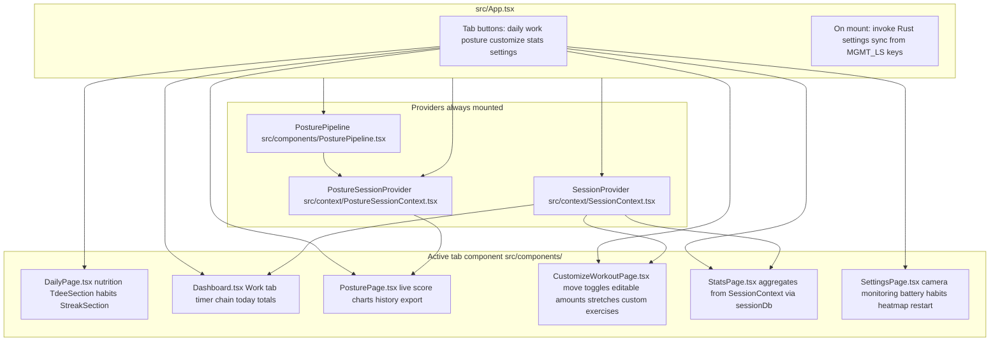
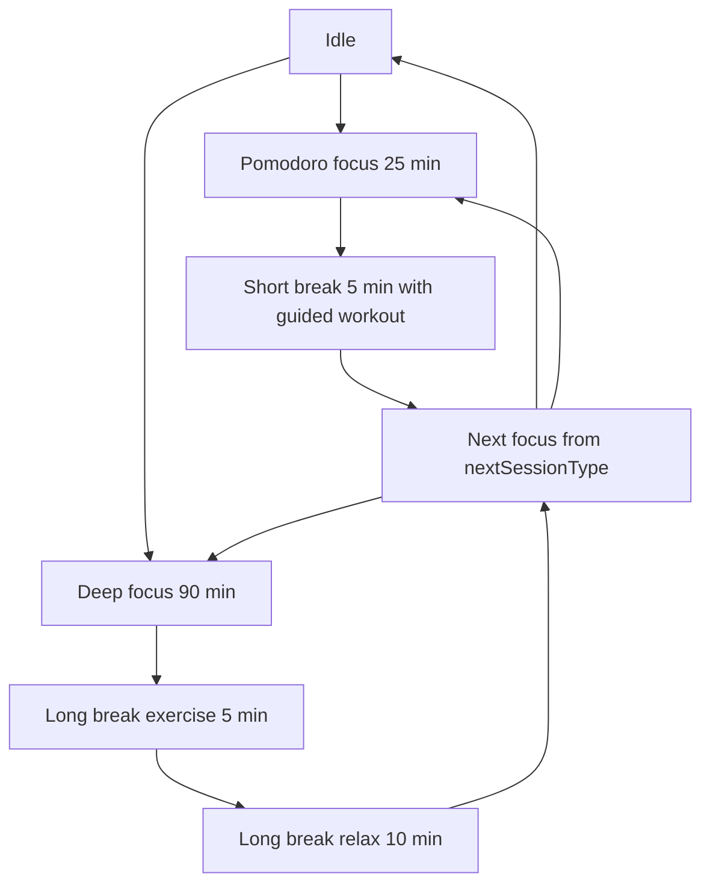
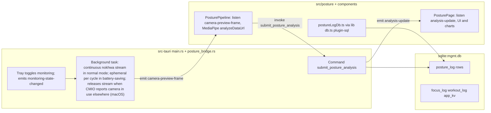

# Management App Architecture

## Product Intent
- The app is being repurposed from posture tracking into a personal background manager for focus and movement.
- **Daily tab** (`DailyPage.tsx`) is the default landing tab: **nutrition** (TDEE targets, today’s food log, staples/regulars) and **habits** (streak tracker heatmaps, daily/weekly activities, pause/reset/archive). Ported from Obsidian plugins; data lives in SQLite (`src/lib/tdeeDb.ts`, `src/lib/streakDb.ts`). Day boundary uses the same `stats_day_rollover_hour_v1` as work/movement stats. Nutrition regulars are edited in the Daily tab add panel (+); staples and TDEE/protein targets are still vault-import or DB-only until Settings UI lands.
- **Work tab** (`Dashboard.tsx`, nav label “Work”) is the session-driven focus flow below.
- Pomodoro sessions are 25 minutes of focus followed by a 5 minute break.
- Deep Work sessions are 90 minutes of focus followed by a long break: 5 minutes of guided exercise then 10 minutes of relax (`SESSION_DURATIONS_MINUTES` in `src/lib/workoutPlanner.ts`, driven by `src/context/SessionContext.tsx`).
- After each Pomodoro focus session, the break is 5 minutes. Guided exercise runs every 2 completed pomodoros in the chain (default); other pomodoro breaks are short relax breaks with sit/stand reminder only. Deep work long breaks always include guided exercise.
- Settings toggle **Can't exercise right now** (`cant_exercise_mode_v1` in `app_kv`, `src/lib/cantExerciseModePref.ts`) limits scheduled break workouts to walking/marching and stretches only; toggle lives on the Work tab (`Dashboard.tsx`), not Settings.
- Header **Start flow** control (`FlowHeaderControl.tsx`, right side of tab bar in `AppShell.tsx`): starts a pomodoro chain when idle (stays on current tab); when a flow is active shows the current phase label (no timer) and switches to the Work tab on click. Tray **Start focus flow** (hidden while a flow runs) uses `startFlow(..., { background: true })` so phase alerts skip bring-to-front; in menu-bar-only mode Rust re-hides the window after the tray action.
- From idle, the Dashboard can start a standalone 5-minute exercise break (no prior focus block); mixed break workouts never repeat the same move id in one break.
- Dashboard shows side-by-side **Today’s work** (pomodoros and deep work completed today) and **Today’s movement** (per-exercise totals including zeros, manual increment buttons, plus upper/lower body stretching time rolled up from all `stretch-*` log rows). Underlying events live in `focus_log` and `workout_log`; “today” is computed with a configurable rollover hour (default 4:00 AM local, `stats_day_rollover_hour_v1` in Settings). Manual increments persist to `workout_log` as manual entries.
- Asymmetric stretch picks (lateral shoulder, one-leg toe touch, standing quad) always schedule left and right in the same break. Stretch hold defaults: neck roll and hip roll 30s; other stretches (including foot stretch) 20s. Shadowboxing default 60s.
- Pomodoro sessions auto-schedule another Pomodoro session by default after the break.
- Users can remove the following focus session or switch the next scheduled focus session between Pomodoro and Deep Work; a break is not labeled as a “session” in the UI.
- During focus, users can convert Pomodoro ↔ Deep Work: remaining time is the target session length minus elapsed focus time (90 min for deep, 25 min for pomodoro); if deep focus already ran more than 25 minutes, switching to Pomodoro starts a full 25-minute block. Partial credit for the prior type applies if that focus phase ran ≥15 seconds.
- The app tracks completed exercise totals over long periods (weeks/months) on the Stats tab; the Dashboard does not show a separate in-flow session totals card.
- Stats tab (`StatsPage.tsx`) uses three subtabs — **All time** (default), Monthly, Weekly — each with large headline totals for **Focus** (pomodoros, deep work sessions, credited focus minutes) and **Movement** (move time as hours/minutes, workouts logged), plus a per-exercise breakdown for exercises with non-zero volume in that period. Weekly and Monthly use a fixed-height split layout: left (~2/5) shows the selected period with arrow navigation; right (~3/5) shows a dual-axis line chart — blue **focus minutes** and orange **move minutes** (both y-axes on the left) over recent periods, with the selected period highlighted in red on both lines. Pomodoro/deep session counts include only logs with `completion_ratio` ≥ 0.75; focus minutes still credit partial sessions proportionally. Weekly/monthly buckets use local calendar week (Monday start) and month; labels are human-readable (e.g. “Week of May 12, 2026”). Dashboard **Today’s work** uses the same 75% rule for session counts.

## Repository layout
- `src/`: React UI, session engine, posture TypeScript (`src/posture/`), shared libs (`src/lib/`).
- `packages/core/`: platform-agnostic session types, flow state, timer math, display helpers (`@mgmt/core`).
- `packages/sync/`: sync client interface, HTTP client, in-memory bus (`@mgmt/sync`).
- `apps/sync-api/`: Turso-backed HTTP API for active session sync (`@mgmt/sync-api`).
- `apps/companion/`: Vite PWA mobile companion (`@mgmt/companion`); break/focus timer viewer; no posture.
- `src-tauri/src/main.rs`: Tauri app entry, tray, background camera loop, SQL migrations, posture ingest command.
- `src-tauri/src/posture_bridge.rs`: posture debouncer and ingest payload types used from `main.rs`.

## Mobile companion (in progress)
- PWA in `apps/companion` (`npm run dev:companion`, port 5173).
- Remote sync uses Turso (libSQL) via `apps/sync-api` (`npm run dev:sync-api`, default `http://localhost:8787`). Clients authenticate with `SYNC_API_TOKEN` / `VITE_SYNC_API_TOKEN` (see `.env.example`).
- Phone is the intended **leader** during exercise breaks; companion auto-claims leadership and desktop enters viewer mode (`isSyncViewer` in `sessionSync.ts`).
- Shared session logic lives in `@mgmt/core`; desktop `src/lib/flowState.ts` and `src/lib/sessionProgress.ts` re-export from there.
- `@mgmt/sync` defines `ActiveFlowDocument`, `HttpSyncClient`, and `createSyncClient`; `MemorySyncClient` remains for offline dev without the API.
- Companion UI reuses desktop Tailwind tokens and shadcn `Card`/`Button` via Vite aliases; scope excludes posture, camera, and tray settings.

## Frontend Runtime
- The desktop app uses Tauri with a React + TypeScript frontend (`src/main.tsx` → `src/App.tsx`).
- Posture landmarks and scoring run in the webview using MediaPipe Tasks (`@mediapipe/tasks-vision`) with the weighted metric pipeline adapted from [BatesPosture](https://github.com/wtbates99/batesposture); Rust captures periodic camera frames for preview and receives scored results from the frontend for ingest, SQLite logging, and desktop notifications.
- Navigation and provider wiring are summarized in the first system map below.

## Data Persistence
- SQLite database id `sqlite:mgmt.db` (`src/lib/db.ts`; Tauri SQL plugin `preload` in `src-tauri/tauri.conf.json`) holds all durable history. On disk the file is `mgmt.db` under the app config directory (`tauri::path::BaseDirectory::AppConfig`), not in the git repo. Bundle identifier: `com.diamari.management` (`src-tauri/tauri.conf.json`). Typical paths: macOS `~/Library/Application Support/com.diamari.management/mgmt.db`; Linux `~/.config/com.diamari.management/mgmt.db`; Windows `%APPDATA%\com.diamari.management/mgmt.db`. `tauri dev` uses the same config dir for that identifier. `mgmt.db` is created and migrated by the SQL plugin on first use; startup does not copy or replace it from any other file.
  - Tables in `mgmt.db`:
    - `posture_log` — posture samples (written from Rust `submit_posture_analysis`; read in Posture tab via `src/posture/postureLogDb.ts`).
    - `focus_log` / `workout_log` — completed focus sessions and break workouts for the Stats tab (`src/lib/sessionDb.ts`, `SessionContext`). Focus rows store partial credit when a focus phase ends early (`completion_ratio`). Phases shorter than 15 seconds are not logged. Stopping the flow during an exercise break does not create a workout row; a workout is logged only when the break timer finishes (≥15s in that break) or the user taps Complete Workout (≥15s in that break). Complete Workout always ends the exercise portion immediately and advances the flow (next focus, long-break relax, or idle for standalone breaks); workout logging on that tap still requires ≥15s in the break.
    - `app_kv` — allowed workout ids (legacy), `workout_customize_prefs_v1` (per-exercise amounts, stretch pick toggles, hold seconds, custom exercises), `cant_exercise_mode_v1` (discreet break moves only; default off), migration flags, last ended-flow summary, `active_flow_state_v1` (in-progress timer, chain counters, and break workout), `posture_monitoring_enabled_v1` (posture tracking on/off; default on when unset), `app_presence_mode_v1` (`dock` = normal app in Dock/App Switcher on macOS; `menu_bar` = menu-bar-only with system tray, hide-on-close; default `dock` when unset), `stats_day_rollover_hour_v1` (local hour when “today” stats reset; default 4; shared by work stats, nutrition log day, and streak current day), `streak_heatmap_color_v1` (optional hex for daily habits heatmap; default green CSS when unset), `vault_import_tdee_v1` / `vault_import_streak_v1` (timestamps set by one-time vault import script), and session alert prefs (`session_alert_sound_v1`, `session_alert_countdown_sound_v1`, `session_alert_focus_window_v1`, `session_alert_dock_bounce_v1`, `session_alert_notify_v1`, `session_tray_timer_v1`; defaults: sound, countdown, and focus window on; dock bounce, notify, and tray timer off — see `src/lib/sessionAlertsPref.ts` and Settings).
    - `nutrition_config`, `nutrition_staples`, `nutrition_regulars`, `nutrition_entries` — TDEE targets, meal defs, and today-only log entries (`src/lib/tdeeDb.ts`, migration v5).
    - `streak_activities`, `streak_log_cells`, `streak_activity_meta` — habit definitions, per-day log cells, pause/reset meta (`src/lib/streakDb.ts`, migration v6).
- Before session tables existed, focus/workout stats used browser `localStorage` only (not the posture SQLite file). Legacy keys are imported into SQLite when present; `localStorage` is not used for stats anymore.
- Posture charts also keep a short in-memory buffer in `PostureSessionContext` for the current monitoring session only; long-term posture stats come from `posture_log`.
- Posture calibration image path is stored with `tauri_plugin_store` in `.settings.dat` from `src/components/PosturePage.tsx`; baseline metrics use `localStorage` key `mgmt_posture_baseline_v1`.
- Camera and detection tuning preferences use `localStorage` keys from `src/lib/mgmtLocalStorage.ts` (`MGMT_LS`); `src/App.tsx` pushes those into Rust on startup. Posture tracking on/off is stored in `app_kv` as `posture_monitoring_enabled_v1` (`src/lib/postureMonitoringPref.ts`, default on when unset); boot calls `start_monitoring` or `stop_monitoring` to match, and `monitoring-state-changed` (UI or tray) keeps `app_kv` in sync via `PosturePipeline.tsx`. Legacy `mgmt_posture_monitoring_enabled` in `localStorage` is imported once on first read.

## High-level system maps

These diagrams stay aligned with `src/` and `src-tauri/` whenever navigation, session flow, persistence, or Tauri boundaries change (see definition of done in docs/AGENT.md).

### UI shell, tabs, and shared state

### Session timer flow (implemented in SessionContext)

Durations and workout picking rules are centralized in `src/lib/workoutPlanner.ts`.

### Posture capture, scoring, and persistence (subset of the product)

### Tauri commands the webview calls

Grouped by call site; all are registered on the Rust builder in `main.rs` (`invoke_handler`).

| Area | Command | Called from |
| --- | --- | --- |
| Boot | `set_current_language`, `set_app_presence_mode`, `set_battery_saving_mode`, `set_selected_camera`, `set_monitoring_interval`, `set_detection_settings` | `src/App.tsx` |
| Session alerts | `focus_main_window`, `set_tray_session_label`, `set_session_tray_timer_enabled`, `set_tray_flow_active`, `notify_session_phase` | `src/components/SessionAlerts.tsx`, `FlowHeaderControl.tsx` (prefs in `sessionAlertsPref.ts`; tray via `app_presence.rs`) |
| Settings | same tuning commands plus `get_available_cameras`, `set_app_presence_mode`, session alert prefs (saved in `app_kv`, applied via `SessionAlerts`), stats day rollover, habits heatmap color (`streakHeatmapPref.ts`), `restart_app` | `src/components/SettingsPage.tsx` |
| Posture pipeline | `submit_posture_analysis` | `src/components/PosturePipeline.tsx` |
| Posture page | `initialize_pose_model`, `save_calibrated_image`, `delete_calibrated_image`, `clear_posture_debouncer`, `get_monitoring_status`, `request_preview_frame` | `src/components/PosturePage.tsx` |

### Events Rust emits and the webview listens for

| Event | Purpose | Listeners |
| --- | --- | --- |
| `camera-preview-frame` | JPEG data URL for preview or MediaPipe input | `PosturePipeline.tsx`, `PosturePage.tsx` |
| `analysis-update` | Debounced posture flags, score, recommendations, metrics JSON | `PosturePage.tsx` |
| `monitoring-state-changed` | `{ active: boolean }` tray or command driven | `PosturePipeline.tsx`, `PosturePage.tsx` |
| `tray-start-focus-flow` | Tray menu **Start focus flow** | `FlowHeaderControl.tsx` |
| `camera-yield-changed` | `{ paused: boolean, reason: string }` macOS CMIO detects another app using the camera | `PosturePage.tsx` |

Tray and `start_monitoring` / `stop_monitoring` commands exist in Rust for monitoring lifecycle; the webview applies saved preference on startup (`App.tsx`) and syncs tray-driven changes back to `posture_monitoring_enabled_v1` in `app_kv`. App presence (`app_presence_mode_v1`, Settings toggle) is applied on boot via `set_app_presence_mode` (`src/lib/appPresencePref.ts`): `dock` uses macOS `ActivationPolicy::Regular` with no tray unless `session_tray_timer_v1` is on (Dock plus menu-bar icon with live `set_title` countdown); `menu_bar` uses `Accessory` plus tray (posture menu) and hide-on-close. Session phase sounds and countdown use Web Audio in `SessionAlerts.tsx`; focus/notify/tray toggles are in Settings.
