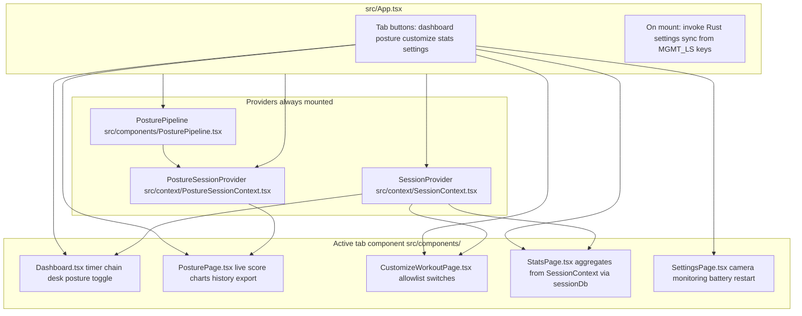
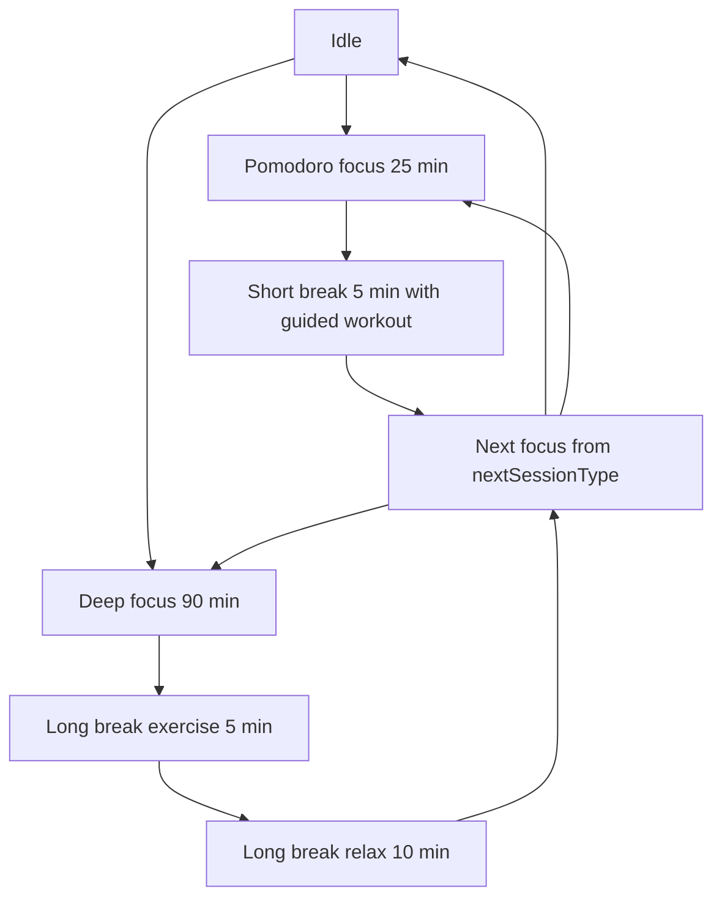
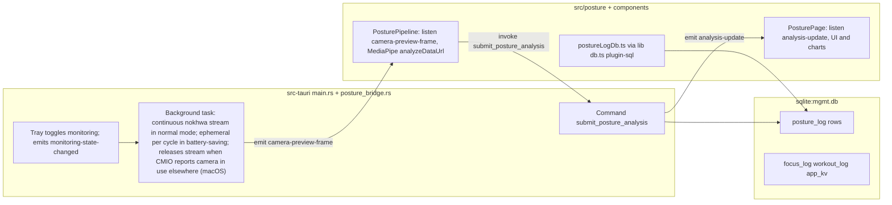

# Management App Architecture

## Product Intent
- The app is being repurposed from posture tracking into a personal background manager for focus and movement.
- The core workflow is session-driven: users run either a Pomodoro focus session or a Deep Work focus session.
- Pomodoro sessions are 25 minutes of focus followed by a 5 minute break.
- Deep Work sessions are 90 minutes of focus followed by a long break: 5 minutes of guided exercise then 10 minutes of relax (`SESSION_DURATIONS_MINUTES` in `src/lib/workoutPlanner.ts`, driven by `src/context/SessionContext.tsx`).
- After each Pomodoro focus session, the break includes a short guided workout and a sit/stand switch reminder.
- Pomodoro sessions auto-schedule another Pomodoro session by default after the break.
- Users can remove the following focus session or switch the next scheduled focus session between Pomodoro and Deep Work; a break is not labeled as a “session” in the UI.
- The app tracks and displays completed exercise totals for the current session and over long periods (weeks/months).
- The app tracks how many Deep Work sessions were completed during the current day.

## Repository layout
- `src/`: React UI, session engine, posture TypeScript (`src/posture/`), shared libs (`src/lib/`).
- `src-tauri/src/main.rs`: Tauri app entry, tray, background camera loop, SQL migrations, posture ingest command.
- `src-tauri/src/posture_bridge.rs`: posture debouncer and ingest payload types used from `main.rs`.

## Frontend Runtime
- The desktop app uses Tauri with a React + TypeScript frontend (`src/main.tsx` → `src/App.tsx`).
- Posture landmarks and scoring run in the webview using MediaPipe Tasks (`@mediapipe/tasks-vision`) with the weighted metric pipeline adapted from [BatesPosture](https://github.com/wtbates99/batesposture); Rust captures periodic camera frames for preview and receives scored results from the frontend for ingest, SQLite logging, and desktop notifications.
- Navigation and provider wiring are summarized in the first system map below.

## Data Persistence
- SQLite database id `sqlite:mgmt.db` (`src/lib/db.ts`; Tauri SQL plugin `preload` in `src-tauri/tauri.conf.json`) holds all durable history. On disk the file is `mgmt.db` under the app config directory (`tauri::path::BaseDirectory::AppConfig`), not in the git repo. Bundle identifier: `com.diamari.management` (`src-tauri/tauri.conf.json`). Typical paths: macOS `~/Library/Application Support/com.diamari.management/mgmt.db`; Linux `~/.config/com.diamari.management/mgmt.db`; Windows `%APPDATA%\com.diamari.management\mgmt.db`. `tauri dev` uses the same config dir for that identifier. On first launch, if `posture_data.db` exists in that folder and `mgmt.db` does not, Rust copies the legacy file to `mgmt.db` (`src-tauri/src/main.rs` setup).
  - Tables in `mgmt.db`:
    - `posture_log` — posture samples (written from Rust `submit_posture_analysis`; read in Posture tab via `src/posture/postureLogDb.ts`).
    - `focus_log` / `workout_log` — completed focus sessions and break workouts for the Stats tab (`src/lib/sessionDb.ts`, `SessionContext`). Focus rows store partial credit when a focus phase ends early (`completion_ratio`). Phases shorter than 15 seconds are not logged. Stopping the flow during an exercise break does not create a workout row; a workout is logged only when the break timer finishes (≥15s in that break) or the user taps Complete Workout (≥15s in that break).
    - `app_kv` — allowed workout ids, migration flags, last ended-flow summary, and `active_flow_state_v1` (in-progress timer, chain counters, and break workout) so a restart resumes the same session.
- Before session tables existed, focus/workout stats used browser `localStorage` only (not the posture SQLite file). Legacy keys are imported into SQLite when present; `localStorage` is not used for stats anymore.
- Posture charts also keep a short in-memory buffer in `PostureSessionContext` for the current monitoring session only; long-term posture stats come from `posture_log`.
- Posture calibration image path is stored with `tauri_plugin_store` in `.settings.dat` from `src/components/PosturePage.tsx`; baseline metrics use `localStorage` key `mgmt_posture_baseline_v1`.
- Camera and monitoring preferences use `localStorage` keys from `src/lib/mgmtLocalStorage.ts` (`MGMT_LS`); `src/App.tsx` pushes those into Rust on startup.

## High-level system maps

These diagrams stay aligned with `src/` and `src-tauri/` whenever navigation, session flow, persistence, or Tauri boundaries change (see definition of done in docs/AGENT.md).

### UI shell, tabs, and shared state

### Session timer flow (implemented in SessionContext)

Durations and workout picking rules are centralized in `src/lib/workoutPlanner.ts`.

### Posture capture, scoring, and persistence (subset of the product)

### Tauri commands the webview calls

Grouped by call site; all are registered on the Rust builder in `main.rs` (`invoke_handler`).

| Area | Command | Called from |
| --- | --- | --- |
| Boot | `set_current_language`, `set_battery_saving_mode`, `set_selected_camera`, `set_monitoring_interval`, `set_detection_settings` | `src/App.tsx` |
| Settings | same tuning commands plus `get_available_cameras`, `restart_app` | `src/components/SettingsPage.tsx` |
| Posture pipeline | `submit_posture_analysis` | `src/components/PosturePipeline.tsx` |
| Posture page | `initialize_pose_model`, `save_calibrated_image`, `clear_posture_debouncer`, `get_monitoring_status`, `request_preview_frame` | `src/components/PosturePage.tsx` |

### Events Rust emits and the webview listens for

| Event | Purpose | Listeners |
| --- | --- | --- |
| `camera-preview-frame` | JPEG data URL for preview or MediaPipe input | `PosturePipeline.tsx`, `PosturePage.tsx` |
| `analysis-update` | Debounced posture flags, score, recommendations, metrics JSON | `PosturePage.tsx` |
| `monitoring-state-changed` | `{ active: boolean }` tray or command driven | `PosturePipeline.tsx`, `PosturePage.tsx` |
| `camera-yield-changed` | `{ paused: boolean, reason: string }` macOS CMIO detects another app using the camera | `PosturePage.tsx` |

Tray and `start_monitoring` / `stop_monitoring` commands exist in Rust for monitoring lifecycle; the webview relies on default monitoring-on startup plus tray events rather than calling those commands directly.
