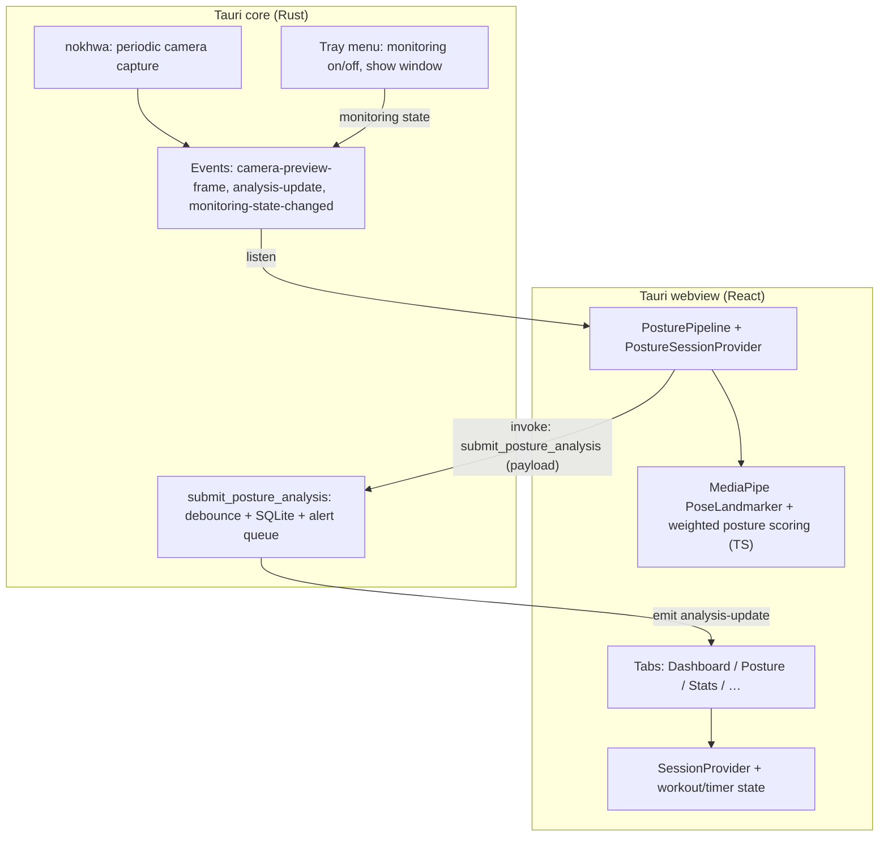

# Management App Architecture

## Product Intent
- The app is being repurposed from posture tracking into a personal background manager for focus and movement.
- The core workflow is session-driven: users run either a Pomodoro focus session or a Deep Work focus session.
- Pomodoro sessions are 25 minutes of focus followed by a 5 minute break.
- Deep Work sessions are 90 minutes with no break.
- After each Pomodoro focus session, the break includes a short guided workout and a sit/stand switch reminder.
- Pomodoro sessions auto-schedule another Pomodoro session by default after the break.
- Users can remove the following focus session or switch the next scheduled focus session between Pomodoro and Deep Work; a break is not labeled as a “session” in the UI.
- The app tracks and displays completed exercise totals for the current session and over long periods (weeks/months).
- The app tracks how many Deep Work sessions were completed during the current day.

## Frontend Runtime
- The desktop app uses Tauri with a React + TypeScript frontend.
- Posture landmarks and scoring run in the webview using MediaPipe Tasks (`@mediapipe/tasks-vision`) with the weighted metric pipeline adapted from [BatesPosture](https://github.com/wtbates99/batesposture); the Rust side captures periodic camera frames for preview and receives scored results from the frontend for logging and notifications.
- Top navigation tabs in `src/App.tsx`: Dashboard, Posture, Customize workout, Stats, Settings.
- Shared session/timer state lives in `src/context/SessionContext.tsx` (`SessionProvider`) so Dashboard, Customize workout, and Stats stay in sync.
- The primary user interface is rendered from `src/App.tsx` and feature components under `src/components/`.
- Session/workout behavior is implemented client-side in the frontend and persisted locally on-device.

## Data Persistence
- User-selected allowed workouts are persisted locally so auto-selection only picks from that list.
- Focus session completion history and workout completion history are stored locally and reused for cumulative stats.

## High-level runtime (mermaid)

