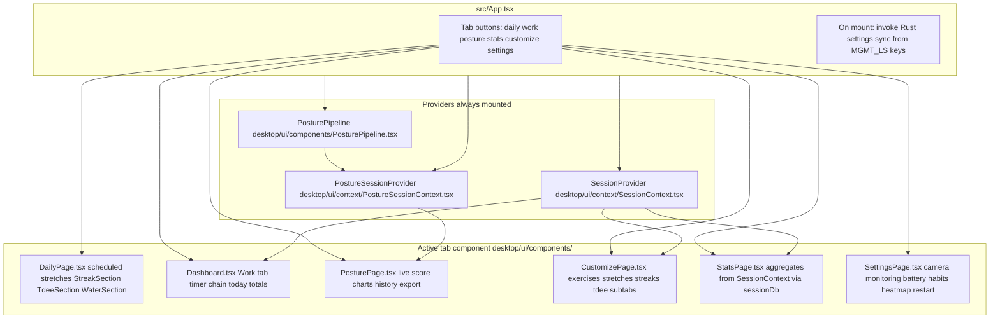
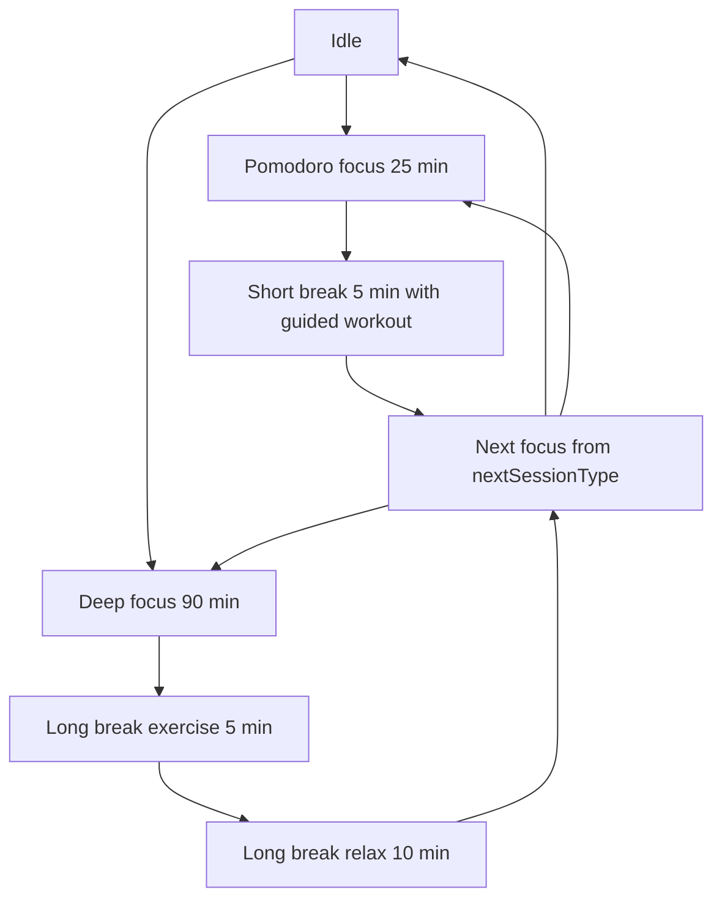
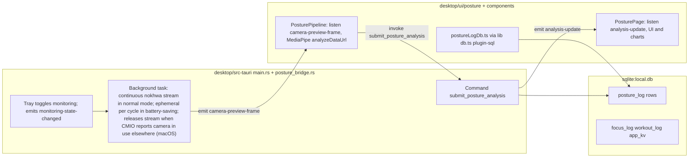

# Management App Architecture

## Product Intent
- The app is being repurposed from posture tracking into a personal background manager for focus and movement.
- **Daily tab** (`DailyPage.tsx`) is the default landing tab: **scheduled stretches** (built-in morning stretch plus user-created routines with a Daily-tab trigger, top section via `DailyStretchSections.tsx`), then **Streaks** (`StreakSection`), **TDEE** (`TdeeSection`), and **Water** (`WaterSection`). Streak success can optionally cross-log calories, protein, and water when configured on an activity. Data: `desktop/ui/lib/stretchCreator/stretchCreatorDb.ts`, `desktop/ui/lib/streakDb.ts`, `desktop/ui/lib/tdeeDb.ts`, `desktop/ui/lib/waterDb.ts`. Day boundary uses `stats_day_rollover_hour_v1` (same as work/movement stats).
- **Customize tab** (`CustomizePage.tsx`) has four subtabs — **Exercises**, **Stretches**, **Streaks**, **TDEE** — and sits between Stats and Settings in the nav. **Stretches** (`CustomizeStretchesPanel.tsx`): stretch creator (all catalog stretches available to routines; predefined moves still require Exercises tab) plus **break stretch pool** at the bottom (`allowedStretchPickKeys` — which stretches may appear in mixed focus-flow exercise breaks only; default hold seconds). Built-in **morning stretch** ships with the app and cannot be deleted. **Exercises** covers predefined break moves and custom exercises only (not the stretch pool). **Streaks**: add/edit/pause/archive/reset streak activities (optional cross-log fields for calories, protein, water). **TDEE** (`CustomizeFoodPanel.tsx`): protein targets, staples, regulars, and water daily goal (litres in UI; stored as ml) in one **Targets** card. Daily tab is log-only (check off habits, log food, log water).
- **Work tab** (`Dashboard.tsx`, nav label “Work”) is the session-driven focus flow below.
- Pomodoro sessions are 25 minutes of focus followed by a 5 minute break.
- Deep Work sessions are 90 minutes of focus followed by a long break: 5 minutes of guided exercise then 10 minutes of relax (`SESSION_DURATIONS_MINUTES` in `desktop/ui/lib/workoutPlanner.ts`, driven by `desktop/ui/context/SessionContext.tsx`).
- After each Pomodoro focus session, the break is 5 minutes. Guided exercise runs every 2 completed pomodoros in the chain (default); other pomodoro breaks are short relax breaks with sit/stand reminder only. The chain count (`pomodoro_break_chain_v1` in `app_kv`) persists across **End Flow** within the same stats day so ending early does not reset exercise-break cadence. Deep work long breaks always include guided exercise.
- Work tab toggle **Can't exercise right now** (`cant_exercise_mode_v1` in `app_kv`, `desktop/ui/lib/cantExerciseModePref.ts`) swaps scheduled exercise breaks for **Very Light Break** (`breakVariant` `very_light`, or long-break stage `very_light`): no prescribed moves — water, bathroom, or quiet phone time only (`desktop/ui/lib/exerciseBreak.ts`, `Dashboard.tsx`). Toggle lives on the Work tab, not Settings.
- **Morning stretch** (built-in stretch in stretch creator, id `morning-stretch`): user-defined ordered routine; default sequence neck roll, lateral shoulder stretch, hip roll, arm rolls, deep squat, standing forward hang. Exercise choices come only from the global pool enabled in Customize workouts. Timed block (default 5 min); completion logs to `workout_log` with `workout_id` `morning-stretch`. Section hides after completion or after hide-after time (default 11:00 AM local) until the next stats day. All stretches (built-in + custom) persist in `app_kv` as `stretch_definitions_v1` (`desktop/ui/lib/stretchCreator/`); legacy `morning_stretch_*` keys are migrated on first load and kept in sync for the built-in entry. Scheduled stretches render on Daily via `DailyStretchSections.tsx` / `StretchSection.tsx`; stretch prefs are edited in Customize → Stretches (not Settings).
- Header **Start flow** control (`FlowHeaderControl.tsx`, right side of tab bar in `AppShell.tsx`): starts a pomodoro chain when idle (stays on current tab); when a flow is active shows the current phase label (no timer) and switches to the Work tab on click. Tray **Start focus flow** (hidden while a flow runs) uses `startFlow(..., { background: true })` so phase alerts skip bring-to-front; in menu-bar-only mode or after hide-to-menu-bar-on-close, Rust re-hides the window after the tray action.
- From idle, the Dashboard can start a standalone 5-minute exercise break (no prior focus block); mixed break workouts never repeat the same move id in one break.
- Dashboard shows side-by-side **Today’s work** (pomodoros and deep work completed today) and **Today’s movement** (per-exercise totals including zeros, manual increment buttons, plus upper/lower body stretching time rolled up from all `stretch-*` log rows). Underlying events live in `focus_log` and `workout_log`; “today” is computed with a configurable rollover hour (default 4:00 AM local, `stats_day_rollover_hour_v1` in Settings). Manual increments persist to `workout_log` as manual entries.
- Asymmetric stretch picks (lateral shoulder, one-leg toe touch, standing quad) always schedule left and right in the same break. Stretch hold defaults: neck roll, hip roll, and standing forward hang 30s; other stretches (including foot stretch) 20s. Shadowboxing default 60s.
- Pomodoro sessions auto-schedule another Pomodoro session by default after the break.
- Desktop macOS: closing the laptop lid pauses the active focus flow timer (`flow-lid-pause` / `flow-lid-resume` from `NSWorkspaceScreensDidSleep` / `ScreensDidWake`); opening the lid resumes with the same remaining time. Companion is unaffected.
- Users can remove the following focus session or switch the next scheduled focus session between Pomodoro and Deep Work; a break is not labeled as a “session” in the UI.
- During focus, users can convert Pomodoro ↔ Deep Work: remaining time is the target session length minus elapsed focus time (90 min for deep, 25 min for pomodoro); if deep focus already ran more than 25 minutes, switching to Pomodoro starts a full 25-minute block. Partial credit for the prior type applies if that focus phase ran ≥15 seconds.
- The app tracks completed exercise totals over long periods (weeks/months) on the Stats tab; the Dashboard does not show a separate in-flow session totals card.
- Stats tab (`StatsPage.tsx`) uses three subtabs — **All time** (default), Monthly, Weekly — each with large headline totals for **Focus** (pomodoros, deep work sessions, credited focus minutes) and **Movement** (move time as hours/minutes, workouts logged), plus a per-exercise breakdown for exercises with non-zero volume in that period. Weekly and Monthly use a fixed-height split layout: left (~2/5) shows the selected period with arrow navigation; right (~3/5) shows a dual-axis line chart — blue **focus minutes** and orange **move minutes** (both y-axes on the left) over recent periods, with the selected period highlighted in red on both lines. Pomodoro/deep session counts include only logs with `completion_ratio` ≥ 0.75; focus minutes still credit partial sessions proportionally. Weekly/monthly buckets use local calendar week (Monday start) and month; labels are human-readable (e.g. “Week of May 12, 2026”). Dashboard **Today’s work** uses the same 75% rule for session counts.

## Repository layout
- `desktop/ui/`: React UI, session engine, posture TypeScript (`desktop/ui/posture/`), shared libs (`desktop/ui/lib/`).
- `desktop/src-tauri/`: Tauri app entry (`main.rs`), tray, background camera loop, SQL migrations, posture ingest command (`posture_bridge.rs`).
- `shared/core/`: platform-agnostic session types, flow state, timer math, display helpers (`@mgmt/core`).
- `shared/storage/`: shared SQLite schema migrations and web SQL backends (`@mgmt/storage`).
- `shared/sync/`: sync client interface, HTTP client, sync status helpers, in-memory bus (`@mgmt/sync`).
- `backend/`: SQLite-backed HTTP server for active session sync and shared user data (`@mgmt/server`).
- `mobile/`: Vite PWA for the phone companion (`@mgmt/companion`); break/focus timer viewer; no posture. Reuses `desktop/ui/` screens via Vite aliases.

## Mobile companion
- PWA in `mobile/` (`npm run dev:companion`, port 5173). `CompanionBoot.tsx` mounts immediately with a loading screen while sql.js storage, i18n, and the app shell load in parallel; tab pages stay lazy-loaded. Service worker precaches built assets (including sql-wasm) for reliable offline installs.
- Remote sync goes through `backend/` (`npm run dev:server`, default `http://localhost:8787`). Clients authenticate with `SERVER_TOKEN` / `VITE_SERVER_TOKEN` (see `.env.example`). Sync URL and token are baked in at **build time** via Vite (`getBuildTimeSyncCreds` in `@mgmt/sync`); there is no runtime config file. **Companion (production):** Cloudflare Pages Git build with `VITE_SERVER_URL` and `VITE_SERVER_TOKEN` set in the Cloudflare dashboard. **Desktop:** local root `.env` when running `npm run tauri build`. **Local dev:** root `.env` for both.
- Phone is the intended **leader** during exercise breaks; companion auto-claims leadership and desktop enters viewer mode (`isSyncViewer` in `sessionSync.ts`).
- Shared session logic lives in `@mgmt/core`; desktop `desktop/ui/lib/flowState.ts` and `desktop/ui/lib/sessionProgress.ts` re-export from there.
- `@mgmt/sync` defines `ActiveFlowDocument`, `HttpSyncClient`, and `createSyncClient`; `MemorySyncClient` remains for offline dev without the server running.
- Companion UI reuses all desktop tabs via Vite aliases (`@` → `desktop/ui/`) through `MobileAppShell variant="companion"`, which loads `companionNavItems()` — Daily, Work, Stats, Customize, Settings (no Posture/camera). `CompanionSettingsPage` replaces `SettingsPage` to exclude Tauri-only controls.
- Companion storage: sql.js SQLite backed by IndexedDB (`mgmt-companion-sql`). `CompanionBoot` shows a loading screen (`SyncBootScreen`: “Opening local storage…” then “Getting data from server…”) while `initCompanionStorage` and `runCompanionInitialSync` run. Initial sync uses shared `runBidirectionalInitialSync` in `@mgmt/sync` (pull, registry-driven row merge via `mergeUserData` + `syncRegistry`, push when needed). While the app stays open, both desktop and companion poll `GET /v1/data` every 5s via `startUserDataPolling` in `@mgmt/sync` (started from `startDesktopForegroundPull` / `startCompanionForegroundPull` after boot). Foreground returns also trigger an extra debounced pull. Debounced pushes wait for initial sync bootstrap and never send an empty snapshot. Known-table SQL writes send row-level patches (`POST /v1/data/patch`) with only changed/deleted rows so unrelated rows are not overwritten; unknown mutation SQL falls back to full snapshot push for safety. Server patch apply uses timestamp guards on `app_kv`, `nutrition_entries`, `water_entries`, `streak_log_cells`, and `streak_activities` (incoming row must have `updated_at` >= existing row) so older delayed patches do not overwrite newer device changes. `focus_log` and `workout_log` are append-only on patch conflicts (`ON CONFLICT DO NOTHING`).

## Backend server (backend/)
- Hono HTTP server (`@mgmt/server`); stores active session state in a local SQLite file via `better-sqlite3`.
- One table: `active_flow_singleton` — the live `ActiveFlowDocument` (timer phase, break workout, leader device).
- User data sync endpoints: `GET /v1/data` (full snapshot), `POST /v1/data` (replace all synced tables), `POST /v1/data/patch` (row-level upsert/delete patch for granular sync pushes).
- Env vars: `SERVER_TOKEN` (bearer auth), `PORT` (default 8787), `DB_PATH` (optional absolute path; defaults to `backend/data/server.db`).
- In production the server runs on a VPS; `DB_PATH` points to a persistent path outside the repo.

## Frontend Runtime
- The desktop app uses Tauri with a React + TypeScript frontend (`desktop/ui/main.tsx` → `desktop/ui/App.tsx`).
- Desktop sync uses the same build-time `VITE_*` creds (from local `.env` at `tauri build`) and the same `runBidirectionalInitialSync` / `pullAndMergeUserData` helpers as the companion. `DesktopBoot` (`desktop/ui/components/DesktopBoot.tsx`) shows `SyncBootScreen` until local SQLite is open and initial sync completes, then mounts `App`. Debounced pushes after local writes wait until initial sync finishes (`desktop/ui/lib/dataSyncBootstrap.ts`). While the app stays open, desktop polls `GET /v1/data` every 5s (same `startUserDataPolling` helper as companion). UI listens for `DATA_SYNC_REFRESH_EVENT` to reload Daily/Customize sections after a pull. Settings shows a `SyncStatusCard` (desktop + companion) with pending local changes, last pull/push time, last operation result, and last sync error message.
- App icon: solid royal blue (`#4169E1`) rounded square for Dock, notifications, and favicon; macOS menu bar tray uses a white rounded square (`desktop/src-tauri/icons/tray.png`, dimmed `monitoring_off.png` when posture monitoring is off) and is always installed at startup. Companion PWA uses the same royal blue icon (`mobile/public/`). Shared color constant: `desktop/ui/lib/brandIcon.ts`.
- Posture landmarks and scoring run in the webview using MediaPipe Tasks (`@mediapipe/tasks-vision`) with the weighted metric pipeline adapted from [BatesPosture](https://github.com/wtbates99/batesposture); Rust captures periodic camera frames for preview and receives scored results from the frontend for ingest, SQLite logging, and desktop notifications.
- Navigation and provider wiring are summarized in the first system map below.

## Data Persistence
- SQLite database id `sqlite:local.db` (`desktop/ui/lib/db.ts`; Tauri SQL plugin `preload` in `desktop/src-tauri/tauri.conf.json`) holds all durable desktop history. On disk the file is `local.db` under the app config directory (`tauri::path::BaseDirectory::AppConfig`). Bundle identifier: `com.diamari.management` (`desktop/src-tauri/tauri.conf.json`). Typical paths: macOS `~/Library/Application Support/com.diamari.management/local.db`; Linux `~/.config/com.diamari.management/local.db`; Windows `%APPDATA%\com.diamari.management\local.db`. `tauri dev` uses the same config dir. On first startup, `migrate_db_name_if_needed()` in `main.rs` renames `mgmt.db` → `local.db` if the old name exists and the new one does not. `local.db` is the desktop working copy; `server.db` is the shared source of truth for all devices.
- `server.db` (`backend/data/server.db` by default, overridden with `DB_PATH`) mirrors all `local.db` tables plus a `users` table and `user_id` on every row. Owner user ID is seeded on server startup from `OWNER_USER_ID` env var (default `'owner'`). Companion reads data via `GET /v1/data`; full data can be pushed via `POST /v1/data`. **Sync safety:** clients never `POST` a fully empty snapshot; `hydrateDbFromServer` skips applying an empty server pull when local data exists; the server rejects `POST /v1/data` with HTTP 409 when the payload would replace existing rows with an empty snapshot (`DataWipeRefusedError` in `@mgmt/sync`).
  - Tables in `local.db`:
    - `posture_log` — posture samples (written from Rust `submit_posture_analysis`; read in Posture tab via `desktop/ui/posture/postureLogDb.ts`).
    - `focus_log` / `workout_log` — completed focus sessions and break workouts for the Stats tab (`desktop/ui/lib/sessionDb.ts`, `SessionContext`). Focus rows store partial credit when a focus phase ends early (`completion_ratio`). Phases shorter than 15 seconds are not logged. Stopping the flow during an exercise break does not create a workout row; a workout is logged only when the break timer finishes (≥15s in that break) or the user taps Complete Workout (≥15s in that break). Complete Workout always ends the exercise portion immediately and advances the flow (next focus, long-break relax, or idle for standalone breaks); workout logging on that tap still requires ≥15s in the break.
    - `app_kv` — allowed workout ids (legacy), `workout_customize_prefs_v1` (per-exercise amounts, stretch pick toggles, hold seconds, custom exercises), `stretch_definitions_v1` (all stretch routines: built-in morning stretch + user-created; migrates from legacy `morning_stretch_*` keys), legacy `morning_stretch_routine_v1` / `morning_stretch_enabled_v1` / `morning_stretch_duration_minutes_v1` / `morning_stretch_hide_after_hour_v1` (kept in sync for built-in morning stretch), `cant_exercise_mode_v1` (very light breaks instead of exercise breaks; default off), `pomodoro_break_chain_v1` (completed pomodoros toward exercise-break cadence within the stats day; survives End Flow), migration flags, last ended-flow summary, `active_flow_state_v1` (in-progress timer, chain counters, and break workout), `posture_monitoring_enabled_v1` (posture tracking on/off; default on when unset), `app_presence_mode_v1` (`dock` = normal app in Dock/App Switcher on macOS; `menu_bar` = menu-bar-only with system tray, hide-on-close; default `dock` when unset), `hide_to_menu_bar_on_close_v1` (Dock mode only: red close button hides the window, removes the Dock icon, and keeps a menu bar tray until Quit; default off when unset; ignored when `app_presence_mode_v1` is `menu_bar`), `stats_day_rollover_hour_v1` (local hour when “today” stats reset; default 4; shared by work stats, nutrition log day, and streak current day), `streak_heatmap_color_v1` (optional hex for daily habits heatmap; default green CSS when unset), and session alert prefs (`session_alert_sound_v1`, `session_alert_countdown_sound_v1`, `session_alert_focus_window_v1`, `session_alert_dock_bounce_v1`, `session_alert_notify_v1`, `session_tray_timer_v1`; defaults: sound, countdown, and focus window on; dock bounce, notify, and tray timer off — see `desktop/ui/lib/sessionAlertsPref.ts` and Settings).
    - `nutrition_config`, `nutrition_staples`, `nutrition_regulars`, `nutrition_entries` — TDEE targets, meal defs, and today-only log entries (`desktop/ui/lib/tdeeDb.ts`, migration v5).
    - `water_config`, `water_entries` — daily water target (ml) and today-only log entries (`desktop/ui/lib/waterDb.ts`, migration v8).
    - `streak_activities`, `streak_log_cells`, `streak_activity_meta` — habit definitions (including optional `extra_calories`, `extra_protein`, `extra_water_ml` for cross-log on success), per-day log cells, pause/reset meta (`desktop/ui/lib/streakDb.ts`, migrations v6 and v9).
- Before session tables existed, focus/workout stats used browser `localStorage` only (not the posture SQLite file). Legacy keys are imported into SQLite when present; `localStorage` is not used for stats anymore.
- Posture charts also keep a short in-memory buffer in `PostureSessionContext` for the current monitoring session only; long-term posture stats come from `posture_log`.
- Posture calibration image path is stored with `tauri_plugin_store` in `.settings.dat` from `desktop/ui/components/PosturePage.tsx`; baseline metrics use `localStorage` key `mgmt_posture_baseline_v1`.
- Camera and detection tuning preferences use `localStorage` keys from `desktop/ui/lib/mgmtLocalStorage.ts` (`MGMT_LS`); `desktop/ui/App.tsx` pushes those into Rust on startup. Posture tracking on/off is stored in `app_kv` as `posture_monitoring_enabled_v1` (`desktop/ui/lib/postureMonitoringPref.ts`, default on when unset); boot calls `start_monitoring` or `stop_monitoring` to match, and `monitoring-state-changed` (UI or tray) keeps `app_kv` in sync via `PosturePipeline.tsx`. Legacy `mgmt_posture_monitoring_enabled` in `localStorage` is imported once on first read.

## High-level system maps

These diagrams stay aligned with `desktop/ui/` and `desktop/src-tauri/` whenever navigation, session flow, persistence, or Tauri boundaries change (see definition of done in docs/AGENT.md).

### UI shell, tabs, and shared state

### Session timer flow (implemented in SessionContext)

Durations and workout picking rules are centralized in `desktop/ui/lib/workoutPlanner.ts`.

### Posture capture, scoring, and persistence (subset of the product)

### Tauri commands the webview calls

Grouped by call site; all are registered on the Rust builder in `main.rs` (`invoke_handler`).

| Area | Command | Called from |
| --- | --- | --- |
| Boot | `set_current_language`, `set_app_presence_mode`, `set_hide_to_menu_bar_on_close`, `set_battery_saving_mode`, `set_selected_camera`, `set_monitoring_interval`, `set_detection_settings` | `desktop/ui/App.tsx` |
| Session alerts | `focus_main_window`, `set_tray_session_label`, `set_session_tray_timer_enabled`, `set_tray_flow_active`, `notify_session_phase` | `desktop/ui/components/SessionAlerts.tsx`, `FlowHeaderControl.tsx` (prefs in `sessionAlertsPref.ts`; tray via `app_presence.rs`) |
| Settings | same tuning commands plus `get_available_cameras`, `set_app_presence_mode`, `set_hide_to_menu_bar_on_close`, session alert prefs (saved in `app_kv`, applied via `SessionAlerts`), stats day rollover, habits heatmap color (`streakHeatmapPref.ts`), `restart_app` | `desktop/ui/components/SettingsPage.tsx` |
| Posture pipeline | `submit_posture_analysis` | `desktop/ui/components/PosturePipeline.tsx` |
| Posture page | `initialize_pose_model`, `save_calibrated_image`, `delete_calibrated_image`, `clear_posture_debouncer`, `get_monitoring_status`, `request_preview_frame` | `desktop/ui/components/PosturePage.tsx` |

### Events Rust emits and the webview listens for

| Event | Purpose | Listeners |
| --- | --- | --- |
| `camera-preview-frame` | JPEG data URL for preview or MediaPipe input | `PosturePipeline.tsx`, `PosturePage.tsx` |
| `analysis-update` | Debounced posture flags, score, recommendations, metrics JSON | `PosturePage.tsx` |
| `monitoring-state-changed` | `{ active: boolean }` tray or command driven | `PosturePipeline.tsx`, `PosturePage.tsx` |
| `tray-start-focus-flow` | Tray menu **Start focus flow** | `FlowHeaderControl.tsx` |
| `flow-lid-pause` / `flow-lid-resume` | macOS display sleep / wake (lid close / open); pauses desktop focus flow timer | `SessionContext.tsx` (`syncMode` desktop only) |
| `camera-yield-changed` | `{ paused: boolean, reason: string }` macOS CMIO detects another app using the camera | `PosturePage.tsx` |

Tray and `start_monitoring` / `stop_monitoring` commands exist in Rust for monitoring lifecycle; the webview applies saved preference on startup (`App.tsx`) and syncs tray-driven changes back to `posture_monitoring_enabled_v1` in `app_kv`. The menu bar tray is always installed at startup (`install_tray` in `main.rs` setup) with Show App, Start focus flow, posture monitoring toggles, and Quit. App presence (`app_presence_mode_v1`, Settings toggle) is applied on boot via `set_app_presence_mode` (`desktop/ui/lib/appPresencePref.ts`): `dock` uses macOS `ActivationPolicy::Regular` (Dock icon visible while the window is open); `menu_bar` uses `Accessory` (no Dock icon) and hide-on-close. **Hide to menu bar on close** (`hide_to_menu_bar_on_close_v1`, Settings toggle under menu bar only, `desktop/ui/lib/hideToMenuBarOnClosePref.ts`) applies only in Dock mode: closing the window hides it and switches to `Accessory` (Dock icon gone) while the menu bar tray stays; reopening the window restores `Regular`. `session_tray_timer_v1` only controls whether a live countdown appears in the tray title during a flow — not whether the tray exists. Session phase sounds and countdown use Web Audio in `SessionAlerts.tsx`; focus/notify/tray toggles are in Settings. When **Bring app to front** (`session_alert_focus_window_v1`) fires on a phase change, the shell switches to the Work tab before focusing the window.
