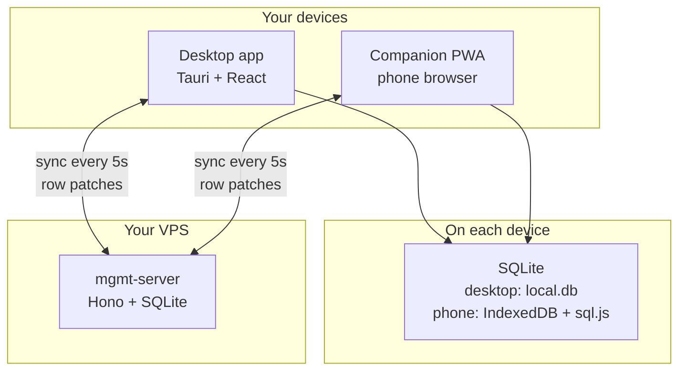
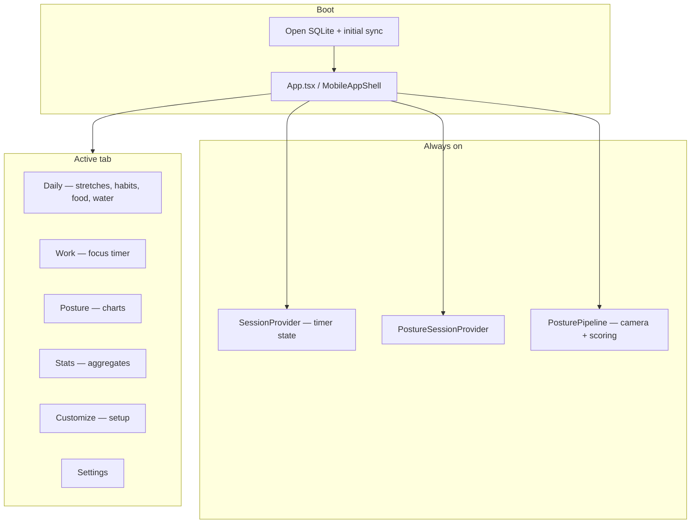
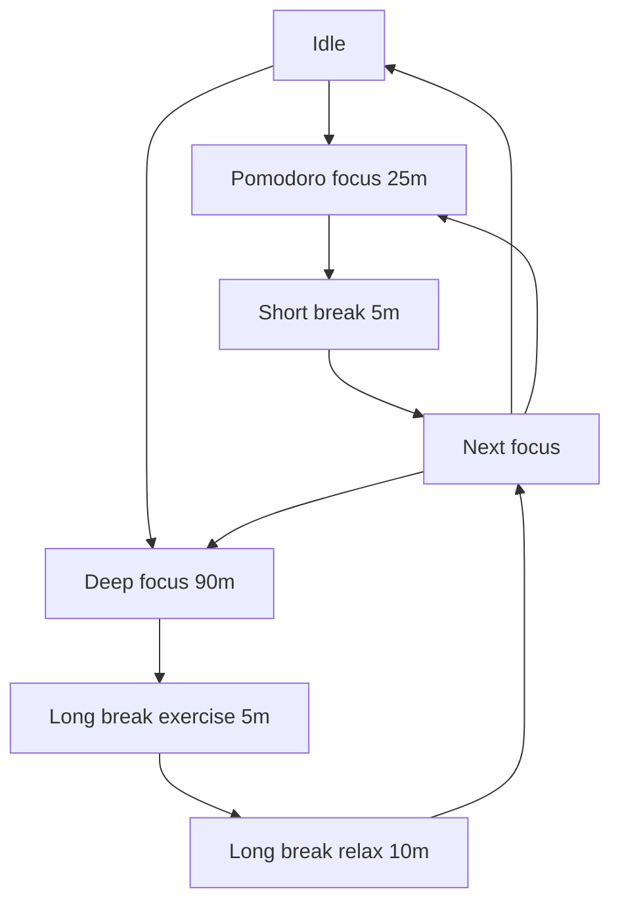
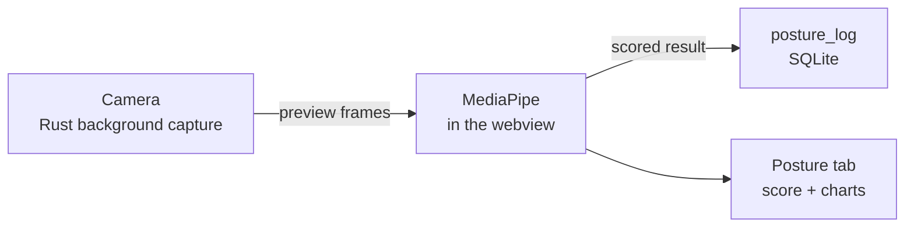

# Architecture (human-readable)

**Management** is a personal desktop app (macOS via Tauri) with a phone companion (PWA). It helps you stay focused (Pomodoro / Deep Work timers), move during breaks, track daily habits and nutrition, and monitor posture from your webcam. Data syncs through a small server you run on a VPS so desktop and phone stay aligned.

## Tabs at a glance

| Tab | What you do here |
| --- | --- |
| **Daily** | Morning/scheduled stretches, check off habits, log food and water |
| **Work** | Run focus sessions, see today's pomodoros and movement |
| **Posture** | Live posture score and history (desktop only — needs camera) |
| **Stats** | Weekly/monthly/all-time focus and exercise totals |
| **Customize** | Set up exercises, stretches, habits, and nutrition targets |
| **Settings** | Alerts, sync health, theme, camera, app presence |

The **Start flow** button in the header kicks off a Pomodoro chain from any tab.

## How the pieces connect

Posture data stays on the desktop — it never uploads.

## UI shell

## Focus session flow

Pomodoro = 25 min focus → 5 min break. Deep Work = 90 min focus → 5 min exercise break → 10 min relax.

Every second completed Pomodoro in a chain, the short break includes guided exercises. Deep Work always includes exercise in the long break. Toggle **Can't exercise right now** on the Work tab for water/bathroom breaks instead.

## Posture (desktop)

## Install & update (macOS)

Your data lives outside the app bundle, so replacing the app keeps history.

1. `npm install`
2. `npm run tauri build` — produces `desktop/src-tauri/target/release/bundle/macos/Management.app`
3. `npm run app:deploy` — copies to `/Applications/Management.app`

SQLite file: `~/Library/Application Support/com.diamari.management/local.db`

Backups: `npm run db:backup`

| Command | What it does |
| --- | --- |
| `npm run tauri dev` | Dev desktop app (same data as installed app) |
| `npm run dev` | Browser-only Vite — no SQLite, not for real use |
| `npm run dev:companion` | Phone companion at localhost:5173 |
| `npm run dev:server` | Local sync server at localhost:8787 |

If macOS blocks an unsigned build: System Settings → Privacy & Security, or `xattr -cr /Applications/Management.app`.

## Sync server (VPS)

Desktop and companion talk to `backend/` over HTTPS. Templates: `backend/mgmt-server.service.example`, `backend/server.env.example`.

**One-time setup (summary):**

1. Create `~/prod-apps/management/data` and `/etc/mgmt/server.env` (set `SERVER_TOKEN`, `DB_PATH`)
2. Install systemd unit from `mgmt-server.service.example`
3. `sudo systemctl enable --now mgmt-server`
4. Verify: `curl http://127.0.0.1:8787/health` → `{"ok":true}`

**Client credentials** are fixed at build time — changing the server token requires rebuilding:

| Client | Where to set URL + token |
| --- | --- |
| Companion (production) | Cloudflare Pages → project **mgmt-companion** → Environment variables |
| Desktop | Repo root `.env` on your Mac |
| Local dev | Repo root `.env` |

Companion Cloudflare build: `npm ci && npm run build:companion`, output directory `mobile/dist`.

**Update server code:** `git pull && npm install && sudo systemctl restart mgmt-server`

VPS troubleshooting tables live in `scaffold/PROJECT-KNOWLEDGE.md`.
