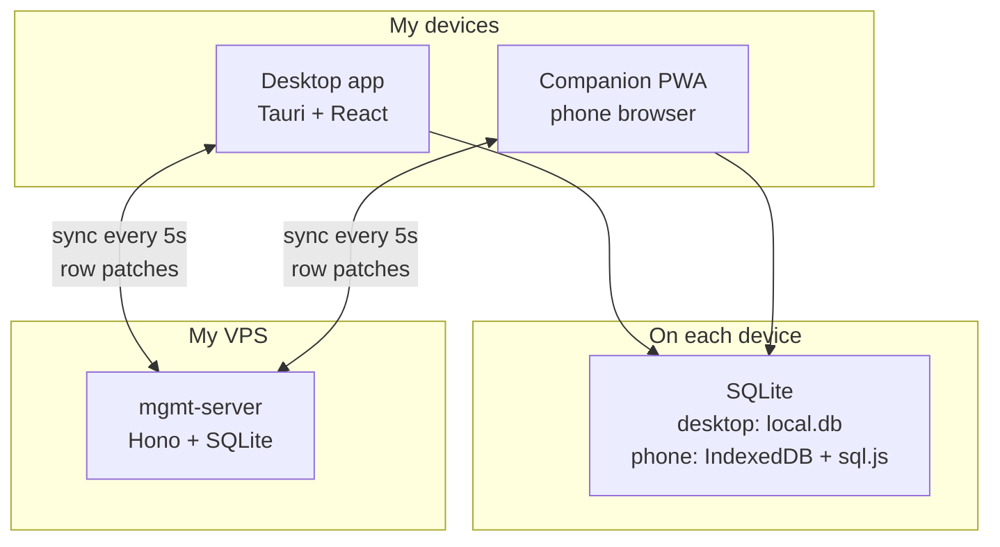
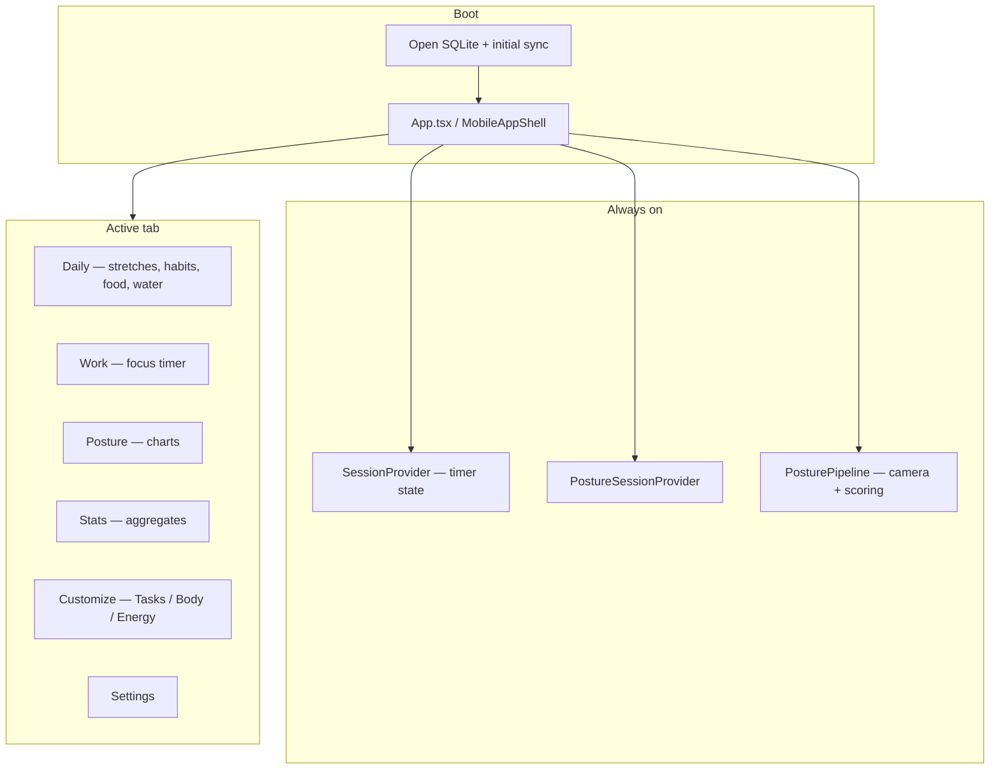
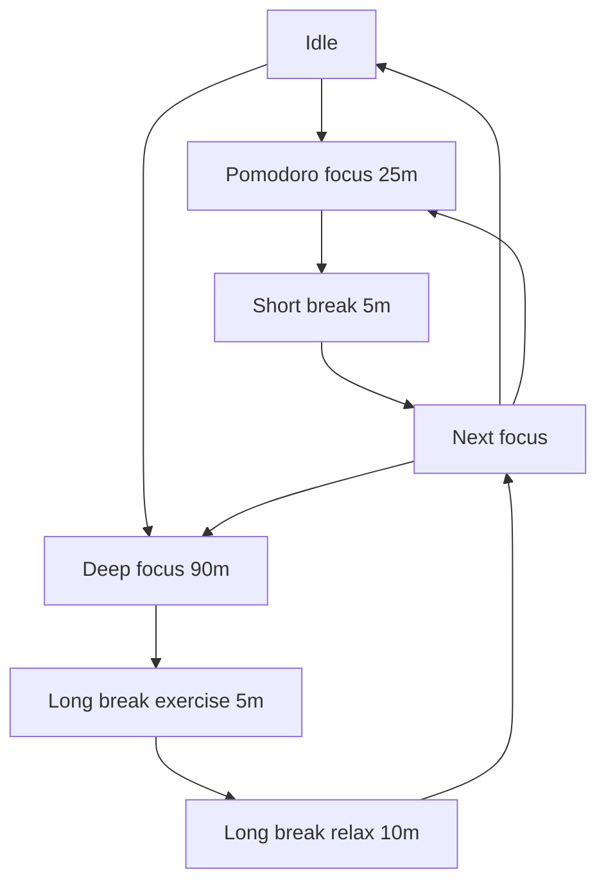
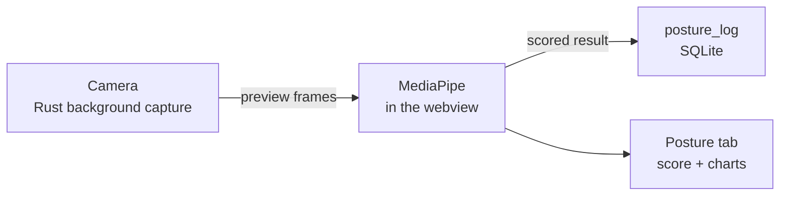

# Architecture (human-readable)

**Management** is a personal desktop app (macOS via Tauri) with a phone companion (PWA). It helps me stay focused (Pomodoro / Deep Work timers), move during breaks, track daily habits and nutrition, and monitor posture from my webcam. Data syncs through a small server I run on my VPS so desktop and phone stay aligned.

## How the pieces connect

Posture data stays on the desktop — it never uploads.

When I **archive** a habit on one device, the other devices should hide it too. Sync keeps archive status sticky (so a simultaneous edit on the other phone can’t accidentally “un-archive” it), and hard deletes leave a small marker (`sync_tombstones`) so deleted rows don’t reappear after the next pull.

**Phone app URL vs sync API:** `https://mgmt.levier.cc` is the sync server (check `/health`). The phone companion PWA is at `https://mgmt-companion.pages.dev` (Cloudflare Pages). Opening the API host in a browser is not meant to show the app UI.

## UI shell

## Focus session flow

Pomodoro = 25 min focus → 5 min break. Deep Work = 90 min focus → 5 min exercise break → 10 min relax.

Every second completed Pomodoro in a chain, the short break includes guided exercises. Deep Work always includes exercise in the long break. Toggle **Can't exercise right now** on the Work tab for water/bathroom breaks instead.

## Posture (desktop)

## Install & update (macOS)

My data lives outside the app bundle, so replacing the app keeps history.

1. `npm install`
2. `npm run tauri build` — produces `desktop/src-tauri/target/release/bundle/macos/Management.app`
3. `npm run app:deploy` — copies to `/Applications/Management.app`

SQLite file: `~/Library/Application Support/com.diamari.management/local.db`

Window size: `~/Library/Application Support/com.diamari.management/window-size.json` — a JSON file, not a SQLite/`app_kv` row. Rust has to apply the last size when the native window is created, before the usual JS + DB pref path is up; putting it in the DB would open at the default size and then jump. Machine-specific (this screen), so it also stays out of sync.

Backups: `npm run db:backup`

| Command                 | What it does                                    |
| ----------------------- | ----------------------------------------------- |
| `npm run tauri dev`     | Dev desktop app (same data as installed app)    |
| `npm run dev`           | Browser-only Vite — no SQLite, not for real use |
| `npm run dev:companion` | Phone companion at localhost:5173               |
| `npm run dev:server`    | Local sync server at localhost:8787             |

If macOS blocks an unsigned build: System Settings → Privacy & Security, or `xattr -cr /Applications/Management.app`.

## Sync server (VPS)

Desktop and companion talk to `backend/` over HTTPS. Templates: `backend/mgmt-server.service.example`, `backend/server.env.example`.

**One-time setup (summary):**

1. Create `~/prod-apps/management/data` and `/etc/mgmt/server.env` (set `SERVER_TOKEN`, `DB_PATH`)
2. Install systemd unit from `mgmt-server.service.example`
3. `sudo systemctl enable --now mgmt-server`
4. Verify: `curl http://127.0.0.1:8787/health` → `{"ok":true}`

**Client credentials** are fixed at build time — changing the server token requires rebuilding:

| Client                 | Where to set URL + token                                              |
| ---------------------- | --------------------------------------------------------------------- |
| Companion (production) | Cloudflare Pages → project **mgmt-companion** → Environment variables |
| Desktop                | Repo root `.env` on my Mac                                            |
| Local dev              | Repo root `.env`                                                      |

Companion Cloudflare build: `npm ci && npm run build:companion`, output `mobile/dist`.

**Update server code:** `git pull && npm install && sudo systemctl restart mgmt-server`

The sync server process takes **daily backups** of `server.db` itself (no extra systemd unit): files land in `data/backups/` next to the DB (or `BACKUP_DIR`), kept for 14 days. If the four `R2_*` vars are set in `/etc/mgmt/server.env`, each snapshot is also uploaded to a Cloudflare R2 bucket (off-VPS copy) with the same retention. Check logs with `journalctl -u mgmt-server | grep db-backup`.
